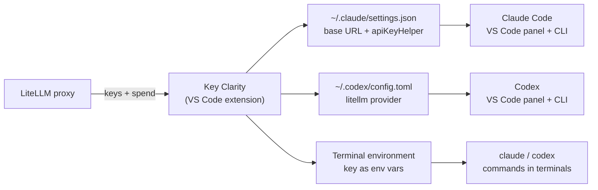

# Key Clarity

**Managing LiteLLM virtual keys for Claude Code and Codex in VS Code: a landscape survey and a proposed extension.**

*As of September 2026. This is the original research. The extension is now being built in this repo; see the [README](../README.md), which supersedes the design notes below where they differ.*

## TL;DR

Teams that route coding agents through a [LiteLLM](https://github.com/BerriAI/litellm) proxy often end up with many virtual keys: one per project, per budget, or per model set. Switching the key that Claude Code or Codex uses means hand-editing config files and restarting.

No existing VS Code extension covers all three of these:

1. List and create your LiteLLM keys and show their spend.
2. Keep the keys in secure storage.
3. Point **both** the Claude Code and Codex VS Code extensions (and their CLIs) at the chosen key in one click.

The pieces exist separately. This repo proposes the glue: a small VS Code extension called **Key Clarity**.

## What exists today

| Tool | Kind | What it does | Gap |
| --- | --- | --- | --- |
| [cc-switch](https://github.com/farion1231/cc-switch) | Desktop app (Tauri), MIT, ~137k stars | Switches Claude Code, Codex, Gemini CLI and others between providers by rewriting their config files. Can make the Claude Code VS Code extension follow its switches. | Not a VS Code extension. Knows nothing about LiteLLM, so it can't create keys or show spend. |
| [Claude Code API Switcher](https://marketplace.visualstudio.com/items?itemName=xiaomila.claude-api-switcher) | VS Code extension, ~1.7k installs | Status bar and sidebar for switching Claude Code provider presets. Writes to `~/.claude/settings.json`. | Claude Code only, no Codex. Keys are kept in a plain-text file. |
| [Claude Code Switcher](https://github.com/manuj10/claude-code-switcher) | VS Code extension | Toggles Claude Code between a subscription and a single API key. | macOS only, one key, no custom base URL. |
| [LiteLLM VS Code extension](https://github.com/BerriAI/litellm/pull/41865) | Official, merged Sep 2026 | Adds LiteLLM models to VS Code's built-in Chat model picker. The key is kept in VS Code SecretStorage. | Doesn't configure Claude Code or Codex (stated in the PR). |
| [LiteLLM `lite` CLI](https://docs.litellm.ai/docs/proxy/management_cli) | Official CLI | `lite login` signs in with SSO. `lite keys generate/list/delete/info` manages keys. `lite claude` / `lite codex` launch the agents with `ANTHROPIC_*` / `OPENAI_*` set. Keys are kept in the OS keychain. | Only affects processes it launches. The VS Code extension panels never see the key. |
| [LiteLLM Claude Code Gateway](https://docs.litellm.ai/docs/tutorials/claude_code_gateway) | Proxy feature | Claude Code signs in through LiteLLM SSO and gets a 24-hour token. | Needs admin setup on the proxy. Claude only. One identity, not a choice between keys. |

## Proposed extension: Key Clarity

A VS Code extension (TypeScript) with a key list in the sidebar and one-click switching for Claude Code and Codex.

1. **Connect to your proxy.** Enter the LiteLLM base URL and a personal key once. It's stored in VS Code `SecretStorage`.
2. **Key list in the sidebar.** Shows alias, allowed models, spend against budget, and expiry for each key (`/key/list`, `/key/info`). Actions: generate a new key (alias, models, budget, duration → `/key/generate`), rename, delete, copy. Keys pasted in by hand appear too, marked "local".
3. **Activate a key for Claude Code, Codex, or both.**
   - **Claude Code:** in `~/.claude/settings.json`, set `env.ANTHROPIC_BASE_URL` and point `apiKeyHelper` at a small script that prints the active key, so the key never lands in the file. The file is shared by the VS Code extension and the CLI.
   - **Codex:** in `~/.codex/config.toml`, add `[model_providers.litellm]` with `base_url = "<proxy>/v1"` and set `model_provider`. The file is shared by the IDE extension and the CLI.
   - **Integrated terminals:** use `environmentVariableCollection` to set the key variables in new terminals, so `claude` and `codex` commands follow along.
4. **Per-project keys (optional).** Write `.claude/settings.local.json` and `.codex/config.toml` in the workspace instead, so each repo bills to its own key.
5. **Status bar badge,** such as `LiteLLM: proj-x · $12/$50`. Clicking it opens a quick picker to switch keys.
6. **Safety.** Back up config files before the first write. Merge rather than overwrite, so hooks, MCP servers and other settings are kept. Refuse to write a key into a git-tracked file. Warn when a key is near its budget or expiry.
7. **Restart prompt.** Running agent sessions read their config at startup, so offer to restart them after a switch.

### How it plugs in

## Known risks and open technical questions

- **Codex key delivery to the IDE extension.** *Resolved.* `env_key` can't be set for another extension's process, but Codex also supports `[model_providers.<id>.auth]`, a command that prints the token. The extension uses that. Project-level `.codex/config.toml` can't change providers, so per-workspace keys are Claude Code only.
- **Codex IDE extension and custom providers.** There are reported bugs where the IDE extension ignores a custom provider or model that the CLI honours ([openai/codex#4558](https://github.com/openai/codex/issues/4558), [#6963](https://github.com/openai/codex/issues/6963)). Test against current versions.
- **Self-service key creation.** By default, LiteLLM only lets `proxy_admin` generate keys. An admin has to allow other roles through `key_generation_settings` ([docs](https://docs.litellm.ai/docs/proxy/virtual_keys)). The extension should hide "Generate" when the proxy refuses.
- **SSO instead of pasted keys.** If the proxy has CLI SSO enabled, the extension could reuse the `lite login` flow.

## Stopgap today

- **Terminal:** `lite claude` / `lite codex` start either agent against your proxy with a chosen key.
- **VS Code panels:** cc-switch can rewrite the config files by hand, with a LiteLLM endpoint entered as a custom provider.

## Later ideas

- Shared team presets: key aliases and model sets, with no secrets.
- Automatic rotation of expiring keys.
- A per-key model picker (`/model_group/info`).
- Cursor and Windsurf support (both run VS Code extensions).

## Sources

- [cc-switch](https://github.com/farion1231/cc-switch)
- [Claude Code API Switcher](https://marketplace.visualstudio.com/items?itemName=xiaomila.claude-api-switcher)
- [Claude Code Switcher](https://github.com/manuj10/claude-code-switcher)
- [LiteLLM VS Code extension, PR #41865](https://github.com/BerriAI/litellm/pull/41865)
- [LiteLLM Proxy CLI](https://docs.litellm.ai/docs/proxy/management_cli)
- [LiteLLM Claude Code Gateway](https://docs.litellm.ai/docs/tutorials/claude_code_gateway)
- [LiteLLM virtual keys](https://docs.litellm.ai/docs/proxy/virtual_keys)
- [Claude Code in VS Code](https://code.claude.com/docs/en/vs-code)
- [Codex config basics](https://learn.chatgpt.com/docs/config-file/config-basic)
- [openai/codex#4558](https://github.com/openai/codex/issues/4558), [openai/codex#6963](https://github.com/openai/codex/issues/6963)
